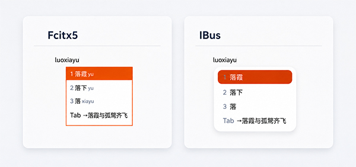

# 言泉输入法 Linux 版

<p align="center">
  
</p>

<p align="center">
  <a href="LICENSE"></a>
  <a href="https://github.com/shenmin/cassotis-ime-linux/actions/workflows/ci.yml"></a>
</p>

<p align="center">
  
</p>

[English](README.md) | 简体中文 | [Windows 版](https://github.com/shenmin/cassotis-ime)

言泉输入法 Linux 版是同时支持 IBus 与 Fcitx 5 的原生中文拼音输入法。
本项目源自
[言泉输入法 Windows 版](https://github.com/shenmin/cassotis-ime)，并使用
[Cassotis Lexicon](https://github.com/shenmin/cassotis-lexicon) 生成的词库。
共享的 Free Pascal 引擎以言泉输入法 v1.21.0 为行为基线，移植了候选召回、
短词排序、长句排序、一键补全、用户学习、模糊拼音与双拼逻辑，并接入语料训练
的多阶段排序链、用于歧义长句的拼音条件 Transformer 评分器、文档局部自适应与
复制补全、受约束的拼音对齐候选生成，以及同时具有词库、读音修复和生成式后备
召回的异步本地补全。词库查询、模型推理、补全与
学习均在本地完成，不依赖云服务、网络连接或 GPU。

## 主要功能

- 使用 [Cassotis Lexicon](https://github.com/shenmin/cassotis-lexicon)
  生成的简体、繁体词库。
- 支持全拼及微软、小鹤、自然码、搜狗、紫光、拼音加加六套双拼方案。
- 移植言泉输入法 v1.21.0 的短词、上下文候选和长句本地统计排序模型链；
  歧义长句比较可以使用与 Windows 版相同的宿主侧条件评分器和受约束候选生成器，
  并由学习式门控决定是否采用模型结果；短词 exact 查询仍使用独立的确定性排序路径。
- 文档局部自适应只使用当前框架已提供的光标附近文本，临时提升文档内重复术语、
  转移关系和已经出现过的续写；有界证据按输入上下文隔离，并在上下文结束时清除，
  不会持久化文档内容。
- 持久化用户学习；选中已学习候选后按 `Ctrl+Delete` 可以删除。
- 受控的一键补全和可配置快捷键；exact 词库、转移、多级后缀、读音修复及文档
  局部召回会先统一选择，受限后台模型随后才可能给出一个受约束续写，置信不足
  则主动放弃。
- IBus 与 Fcitx 5 使用各自的原生适配层，共享同一引擎、设置状态和用户
  词库；候选窗口外观与位置由当前框架及桌面主题负责。
- 提供 GTK 3 设置程序，配置 Linux 版支持的跨平台输入选项。

## 已验证发行环境

v0.5.0 源码以言泉输入法与 Cassotis Lexicon v1.21.0 为行为和
数据基线，并使用匹配的 schema 24 词库。相比 v0.4.0，新版加入 exact 文本
前缀解析，在后续音节尚未输完整时保留完整词库路径，以词库及读音修复选择器
扩展补全召回，并增加按输入上下文隔离的文档续写与复制补全。新增路径均有界、
在本地运行，并在条件不满足时保持原有结果。

x86_64 与 aarch64 的原生验证覆盖
[BENCHMARK.CN.md](BENCHMARK.CN.md) 中的基准。16,300 条长句的 Top1/Top2
分别为 11,080/12,396 和 11,088/12,412，均达到 Windows 公布的汇总成绩；
神经模型的逐条候选不保证完全一致。两个架构的完整短词结果均与 Windows
完全一致。验证还覆盖原生核心与词库测试、安装包内容检查和自动化 IBus/Fcitx
桌面矩阵。每次二进制发行仍须针对精确源码提交，单独通过
[RELEASE.md](RELEASE.md) 中的完整门禁及实际应用界面检查。

v0.5.0 面向 amd64 与 arm64 提供 `.deb` 安装包和便携二进制包。验证环境为
两个架构的 Ubuntu 26.04.1 GNOME Wayland，结果记录在
[BENCHMARK.CN.md](BENCHMARK.CN.md)。已发布安装包及校验信息请以
[GitHub Releases](https://github.com/shenmin/cassotis-ime-linux/releases) 为准。

两种架构的安装包均包含 IBus 与 Fcitx 5 适配层，安装后选择其中一个框架
启用即可。

两种架构的便携包均包含与对应 `.deb` 相同的动态链接二进制文件，仍然要求
系统提供兼容的运行库，并不是与发行版无关的通用安装包。依赖兼容的 Debian
系系统可安装与自身架构相符的软件包；其他发行版建议在本机从源码构建。

具体测试范围和平台状态见 [COMPATIBILITY.md](COMPATIBILITY.md)。

## 安装

从 [GitHub Releases](https://github.com/shenmin/cassotis-ime-linux/releases)
下载与系统架构相符的 `.deb`，将本地计算的 SHA-256 与 Release 资产信息中
显示的摘要核对一致后，再用 APT 安装：

```bash
arch="$(dpkg --print-architecture)"  # 输出 amd64 或 arm64
package="cassotis-ime_0.5.0_${arch}.deb"
sha256sum "${package}"
sudo apt install "./${package}"
```

安装器会刷新当前活动的 IBus 和 Fcitx 5 桌面会话。在使用 IBus 的 GNOME
桌面中，Cassotis 会直接加入输入源列表，无需重启系统或重新登录，也不会
强制切换当前输入源。如果安装时没有活动的图形桌面会话，则会在下次登录时
自动发现 Cassotis。按 `Super+Space` 并选择 **Cassotis 言泉拼音输入法**
即可开始输入。

使用 Fcitx 5 会话时，应先把桌面输入法框架切换为 Fcitx 5，再通过 Fcitx 5
配置工具添加 Cassotis。IBus 与 Fcitx 5 可以同时安装，但当前桌面会话应只
由其中一个框架管理。

设置界面可以从 GNOME 输入源中的 Cassotis“首选项”，或
`fcitx5-configtool` 中 Cassotis 的配置操作打开。安装后的备用命令是
`/usr/libexec/cassotis-ime/cassotis-settings`。

也可以校验并安装与系统架构相符的便携二进制包：

```bash
arch="$(uname -m)"  # 输出 x86_64 或 aarch64
archive="cassotis-ime-linux-0.5.0-${arch}.tar.gz"
sha256sum "${archive}"
tar -xzf "${archive}"
cd "cassotis-ime-linux-0.5.0-${arch}"
sudo ./install.sh
```

便携安装器不会自动解决运行库依赖，所需库见 [BUILD.md](BUILD.md)。

只有使用便携包安装时才使用 `sudo ./uninstall.sh` 卸载；通过软件包安装的
版本应执行 `sudo apt remove cassotis-ime`。两种卸载方式都不会删除用户词库
和设置，并会在安装、卸载时刷新桌面元数据及活动输入法会话。软件包只建议
安装 IBus 或 Fcitx 5 其中一个框架，不会建议同时安装两个桌面守护进程。

## 构建与测试

```bash
./rebuild_all.sh
```

完整的构建、框架安装、基准测试和发行验收命令见：

- [BUILD.md](BUILD.md)
- [配置说明](CONFIGURATION.CN.md)
- [基准测试](BENCHMARK.CN.md) / [English](BENCHMARK.md)
- [RELEASE.md](RELEASE.md)
- [COMPATIBILITY.md](COMPATIBILITY.md)
- [CHANGELOG.md](CHANGELOG.md)
- [词库格式](docs/DICTIONARY.md)
- [IPC 与进程架构](docs/IPC.md)

## 相关项目

- [言泉输入法 Windows 版](https://github.com/shenmin/cassotis-ime)
- [Cassotis Lexicon](https://github.com/shenmin/cassotis-lexicon)

## 许可证

程序源码采用 GPL-3.0-only；随发行包分发的 Cassotis Lexicon 数据库产物采用
CC BY-SA 4.0。详见 [LICENSE](LICENSE) 与 [NOTICE.md](NOTICE.md)。
词库上游来源的归属信息见
[Lexicon Attribution](docs/LEXICON_ATTRIBUTION.md)。
