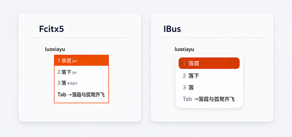

# Cassotis IME for Linux

<p align="center">
  
</p>

<p align="center">
  <a href="LICENSE"></a>
  <a href="https://github.com/shenmin/cassotis-ime-linux/actions/workflows/ci.yml"></a>
</p>

<p align="center">
  
</p>

English | [简体中文](README.CN.md) | [Windows version](https://github.com/shenmin/cassotis-ime)

Cassotis IME for Linux is a native Chinese pinyin input method for both IBus
and Fcitx 5. It is derived from
[Cassotis IME for Windows](https://github.com/shenmin/cassotis-ime) and uses
dictionaries generated by
[Cassotis Lexicon](https://github.com/shenmin/cassotis-lexicon). Its shared
Free Pascal engine ports the candidate recall, short-word ranking,
long-sentence ranking, completion, user learning, fuzzy pinyin, and shuangpin
behavior of the Cassotis IME v1.29.0 baseline. This includes the corpus-trained
multi-stage ranking chain, a compact Pinyin-conditioned Transformer scorer for
ambiguous long sentences, learned gate and fusion decisions, document-local
adaptation and copy completion, constrained Pinyin-aligned candidate
generation, and asynchronous local completion with lexical, phonetic-repair,
and bounded generator recall, plus pinyin-constrained local sentence repair.
Dictionary lookup, model inference, completion,
and learning all run locally without a
cloud service, network connection, or GPU.

## Features

- Simplified and traditional Chinese dictionaries from
  [Cassotis Lexicon](https://github.com/shenmin/cassotis-lexicon).
- Full pinyin and six shuangpin schemes: Microsoft, Xiaohe, Ziranma, Sogou,
  Ziguang, and Pinyin Jiajia.
- Full-pinyin `lue`/`nue` spellings are accepted alongside `lve`/`nve`, and
  `jv`/`qv`/`xv` syllables are normalized to their canonical `ju`/`qu`/`xu` forms.
  Explicit apostrophes still separate syllables, and exact prefixes and single
  characters remain selectable across ambiguous boundaries and partial selection.
- Local statistical ranking for short words, context-aware candidates, and
  long sentences, ported from the Cassotis IME v1.29.0 model chain. Ambiguous
  long-sentence comparisons can use the same compact host-side conditional
  scorer and constrained candidate generator as Windows, with learned gates
  deciding when their output is safe to use. A separate, conservative short-word
  model can use preceding context to swap the first two exact dictionary
  candidates; learned choices, single characters and fuzzy matches are protected.
- A six-layer INT8 local-repair model can correct homophone errors in fully
  aligned simplified-Chinese long sentences. It preserves short, exact and
  user-word queries and checks dictionary evidence before replacing word spans.
  At most 256 characters of the latest preceding context are cached in memory;
  text is neither sent to a server nor stored by this cache.
- Joint candidate selection and a bilateral context check improve local sentence
  repair while retaining the previous candidate when evidence is insufficient.
  Corrected text is kept aligned with one-key completion.
- Pinyin-aligned literary phrase recovery can improve longer sentences without
  replacing trusted user words. Longer sentence prefixes remain available for
  partial selection, and evidence-backed short compounds use the same dictionary
  and language-model signals as the Windows engine.
- Temporary document-local adaptation uses text already exposed by the active
  framework around the cursor to favor recurring terms, transitions, and
  previously seen continuations. Its bounded evidence is isolated by input
  context, cleared when that context ends, and never persisted.
- Persistent user learning. Select a learned candidate and press
  `Ctrl+Delete` to remove it. Learned words follow the selected simplified or
  traditional display mode without duplicating their learning or deletion identity.
- Controlled one-key completion and configurable keyboard shortcuts. Exact
  lexicon, transition, multi-level suffix, phonetic-repair, and document-local
  recall are unified before a bounded background model may propose one
  constrained continuation; low-confidence paths abstain.
- When predictive completion is unavailable, full pinyin can join the visible
  prefix with one fully matched dictionary tail. This bounded conversion never
  recursively builds a sentence or automatically learns the joined text.
  Predictive hints retain their arrow marker; exact-tail conversions show only
  the configured completion key. Background predictions may replace the fallback.
- Function shortcuts can be enabled or disabled individually without losing
  their saved key bindings.
- Native IBus and Fcitx 5 adapters sharing one engine, one settings state, and
  one user dictionary. Candidate appearance and placement are rendered by the
  active framework and desktop theme.
- A GTK 3 settings application for the input options supported on Linux.

## Supported Release

The v0.9.0 source follows Cassotis IME and Cassotis Lexicon v1.29.0, with fresh
schema-24 dictionaries containing 249,342 simplified and 252,554 traditional
base records. These counts include single-character readings from Unihan and
other sources as well as multi-character entries; a character or word may have
multiple reading records, so these are not counts of distinct words. The
simplified dictionary has 23,918 single-character and 225,424 multi-character
records; the traditional dictionary has 24,177 and 228,377 respectively.
Compared with v0.8.0, it adds contextual short-word disambiguation and literary
phrase recovery, improves partial sentence selection and short-compound recall,
and corrects fuzzy common-character ordering. Added readings no longer count the
same text repeatedly as popularity evidence. Expanded specialist entries remain
low-weight exact matches and do not crowd predictive completion.
Precomputed pinyin compatibility and indexed compound-tail lookups avoid repeated
allocation and scans without changing the intended matching rules.
Static completion stays available while background results are pending, and
low-confidence model results leave existing candidates intact.
Models load and warm up in the background. Dictionary candidates, ordinary
selection/commit and static completion remain available before neural models
are ready, so first-key input does not wait for model loading.

Native measurements on x86_64 and aarch64 use the same 16,300 long-sentence
and 65,000 short-word cases as Windows. Counts, latency, memory and any
cross-platform differences are recorded in [BENCHMARK.md](BENCHMARK.md),
rather than assuming identical neural decisions on different CPUs. Release
checks also cover native core and dictionary tests, package payloads, cold-start
responsiveness and the automated IBus/Fcitx desktop matrix. See
[COMPATIBILITY.md](COMPATIBILITY.md) for desktop and framework test coverage.

The v0.9.0 release targets amd64 and arm64 with `.deb` packages and portable
binary archives. Qualification uses Ubuntu 26.04.1 GNOME Wayland on both
architectures; results are recorded in [BENCHMARK.md](BENCHMARK.md).
Use [GitHub Releases](https://github.com/shenmin/cassotis-ime-linux/releases)
for the published packages and their checksums.

Both architecture packages include the IBus and Fcitx 5 adapters; enable
either framework after installation.

Each portable archive contains the same dynamically linked binaries as its
matching `.deb` and requires compatible runtime libraries; it is not a
distribution-independent package. Compatible Debian-family systems can use
the package matching their architecture. On other distributions, run the
portable installer's dependency preflight first; build natively from source
if the supplied binaries are incompatible.

See [COMPATIBILITY.md](COMPATIBILITY.md) for the exact test scope and platform
status.

## Install

Choose the installation method for your system before running any commands:

| System | Download | Installation method |
| --- | --- | --- |
| Debian, Ubuntu and derivatives with compatible dependencies | `.deb` | [APT installation](#debian-installation) |
| SteamOS Desktop Mode and other systems with read-only system directories | `.tar.gz` | [User installation, without sudo](#user-installation) |
| Other distributions with compatible libraries and writable system directories | `.tar.gz` | [System-wide portable installation](#system-installation) |

<a id="debian-installation"></a>

### Debian / Ubuntu: APT Installation

Download the `.deb` matching the system architecture from
[GitHub Releases](https://github.com/shenmin/cassotis-ime-linux/releases),
compare its local SHA-256 value with the digest shown in the release asset
metadata, and install it with APT:

```bash
arch="$(dpkg --print-architecture)"  # amd64 or arm64
package="cassotis-ime_0.9.0_${arch}.deb"
sha256sum "${package}"
sudo apt install "./${package}"
```

The installer refreshes active IBus and Fcitx 5 desktop sessions. On GNOME
with IBus, Cassotis is added to the input-source list without requiring a
reboot or new login; the current input source is not changed. If no graphical
session is active during installation, Cassotis is discovered on the next
login. Press `Super+Space` and select **Cassotis 言泉拼音输入法** to start
typing.

For an Fcitx 5 session, select Fcitx 5 as the desktop input-method framework
and add Cassotis with the Fcitx 5 configuration tool. IBus and Fcitx 5 may
coexist, but only one framework should control the current desktop session.

Open settings from the Cassotis preferences action in GNOME's input-source
settings or from the Cassotis configuration action in `fcitx5-configtool`.
The installed fallback command is
`/usr/libexec/cassotis-ime/cassotis-settings`.

Remove an APT installation with `sudo apt remove cassotis-ime`. Learned words
and settings are retained.

<a id="user-installation"></a>

### SteamOS And Other Read-Only Systems: User Installation

First download the portable archive matching `uname -m` (`x86_64` or `aarch64`)
from [GitHub Releases](https://github.com/shenmin/cassotis-ime-linux/releases)
and verify its SHA-256 value.
In SteamOS **Desktop Mode**, or another desktop with read-only system directories,
use the current portable binary archive to install into your personal directories.
Do not reuse an old install script or run `sudo ./install.sh`. Finish any pending
composition, then open a terminal as the current desktop user. Run these commands
**without `sudo` or `su`**:

```bash
arch="$(uname -m)"  # x86_64 or aarch64
archive="cassotis-ime-linux-0.9.0-${arch}.tar.gz"
sha256sum "${archive}"
tar -xzf "${archive}"
cd "cassotis-ime-linux-0.9.0-${arch}"
./install.sh --user --check &&
./install.sh --user
```

The `--check` command only performs preflight checks;
run the installation command only after those checks pass.

On KDE, automatic selection prefers an installed Fcitx 5; on GNOME it prefers
IBus. Use `--framework fcitx5` or `--framework ibus` if needed. The installer
checks the architecture, shared-library/ABI dependencies and framework version
before copying files. It installs the runtime under `~/.local/libexec/cassotis-ime`
and dictionaries under `${XDG_DATA_HOME:-$HOME/.local/share}/cassotis-ime`,
without writing to `/usr` or disabling filesystem protection. The framework
must already be installed and enabled in the desktop session. The installer
does not install dependencies or switch desktop frameworks. When selecting a
framework explicitly, pass the same option to both commands, for example
`./install.sh --user --framework ibus --check` followed by
`./install.sh --user --framework ibus`.

Select Cassotis in the active framework after installation. If its list has
not refreshed, restart that framework or sign out and back in. The fallback
settings command for a user installation is
`~/.local/libexec/cassotis-ime/cassotis-settings`.

The portable bundle includes an isolated OpenCC fallback for systems without
the conversion library or data; it does not replace system libraries. User
installation, upgrade, removal and desktop input have been tested on SteamOS
3.8.14, KDE X11 with IBus 1.5.32. SteamOS Gaming Mode and Fcitx 5 on SteamOS
are not covered by this test. SteamOS acceptance covers installation and actual
input, not performance benchmarks; those run on the two Ubuntu architectures.
This does not guarantee binary compatibility with
every distribution. If preflight reports incompatible libraries or an older
Fcitx version, use a build for that distribution; do not disable its filesystem
protection. See
[user installation and removal](BUILD.md#portable-user-installation).

To upgrade, extract the new archive and repeat the preflight and installation
commands as the same desktop user.
For `--user` installations, use `./uninstall.sh --user` **without sudo**.
It removes only tracked, unmodified package files and retains learned words
and settings. Do not layer system, source-user and portable-user installations.

<a id="system-installation"></a>

### Other Systems: System-Wide Portable Installation

Use this method only with writable system directories, administrator privileges
and compatible runtime libraries. For SteamOS and other read-only systems, use
[user installation](#user-installation) instead.

```bash
arch="$(uname -m)"  # x86_64 or aarch64
archive="cassotis-ime-linux-0.9.0-${arch}.tar.gz"
sha256sum "${archive}"
tar -xzf "${archive}"
cd "cassotis-ime-linux-0.9.0-${arch}"
sudo ./install.sh
```

The portable installer does not resolve runtime dependencies; see
[BUILD.md](BUILD.md) for the required libraries. Only this system-wide portable
installation uses `sudo ./uninstall.sh` for removal. Learned words and settings
are retained.

## Build And Test

```bash
./rebuild_all.sh
```

Build and framework-install instructions, benchmark results, and compatibility
information are documented in:

- [BUILD.md](BUILD.md)
- [CONFIGURATION.md](CONFIGURATION.md)
- [BENCHMARK.md](BENCHMARK.md) / [简体中文](BENCHMARK.CN.md)
- [COMPATIBILITY.md](COMPATIBILITY.md)
- [CHANGELOG.md](CHANGELOG.md)
- [Dictionary format](docs/DICTIONARY.md)
- [IPC and process architecture](docs/IPC.md)

## Related Projects

- [Cassotis IME for Windows](https://github.com/shenmin/cassotis-ime)
- [Cassotis Lexicon](https://github.com/shenmin/cassotis-lexicon)

## License

The program source is licensed under GPL-3.0-only. Bundled Cassotis Lexicon
database artifacts are licensed under CC BY-SA 4.0. See [LICENSE](LICENSE) and
[NOTICE.md](NOTICE.md), including the bundled
[lexicon attribution](docs/LEXICON_ATTRIBUTION.md).
